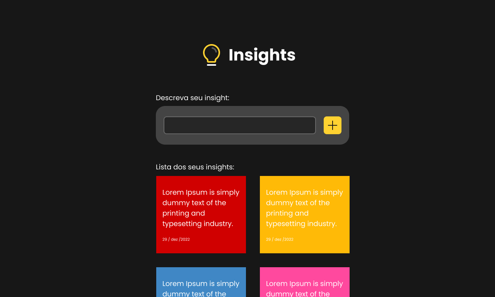

<h1 align="center">Insights</h1>

<div align="center">
    
</div>

## Sobre o Projeto
Insights é uma página para registrar novas ideias, criada usando react e styled-components. Essa página foi um desafio proposto durante a trilha de front-end do curso <a href="https://www.linkedin.com/school/incode-tech-school/">Incode</a> módulo 3.

## Tecnologias usadas
- React
- Styled Components
- Typescript

## Pré-requisitos
- NodeJs
- npm

## Instalando o projeto
Após clonar o projeto ou fazer o download, abra um terminal na pasta do projeto e execute os comandos:
<br/>
1- Instalando as dependências
```bash
  npm install
```

2- Executando o projeto
```bash
  npm run dev
```